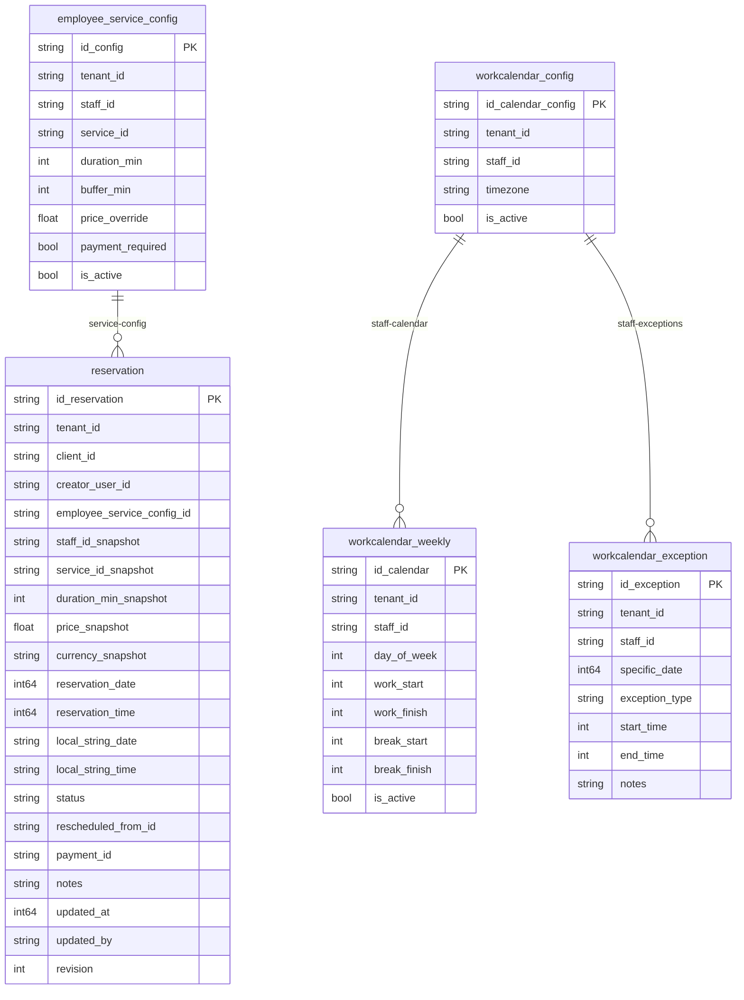

# Database Diagram — appointment-booking

> **Soft references (no physical FK):**
> - `reservation.client_id` → Directory/Clinical module
> - `reservation.creator_user_id` → IAM module
> - `employee_service_config.service_id` → Catalog module
> - `staff_id` fields → Staff module
> - `reservation.payment_id` → Payment module (nullable)
>
> **`workcalendar_config`** is the single source of truth for the IANA timezone of a staff member's calendar.
> `workcalendar_weekly` and `workcalendar_exception` do NOT carry timezone — they inherit it from `workcalendar_config`.
>
> **reservation.status** is enforced by an in-code FSM (not a DB table).
> Availability rules (calendar + exceptions) are enforced at the service layer, not via DB relations.
