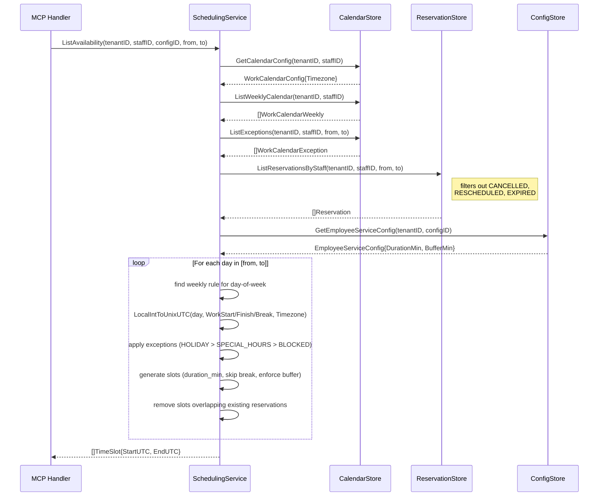
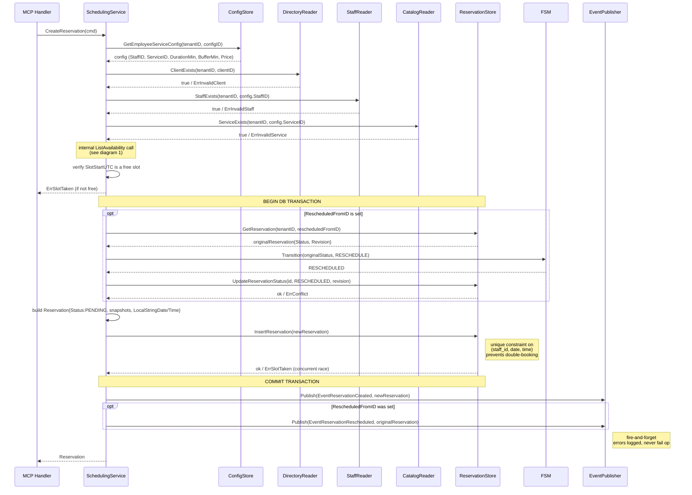
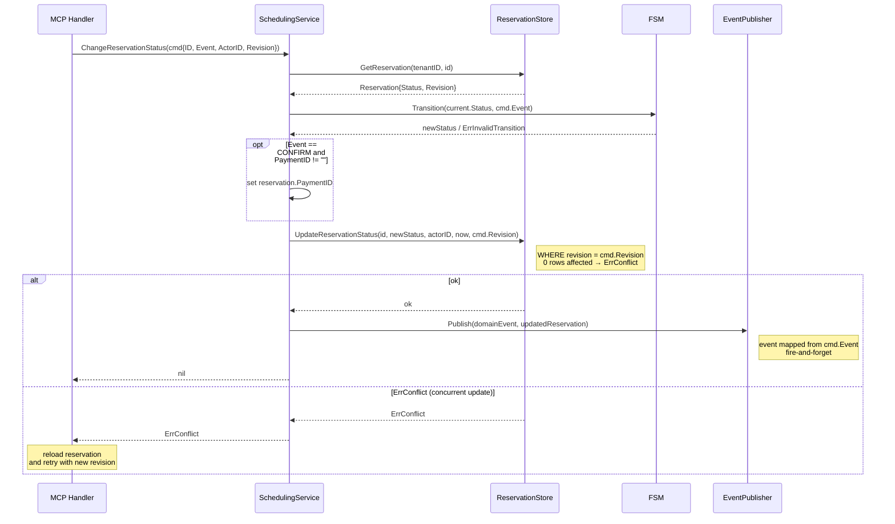
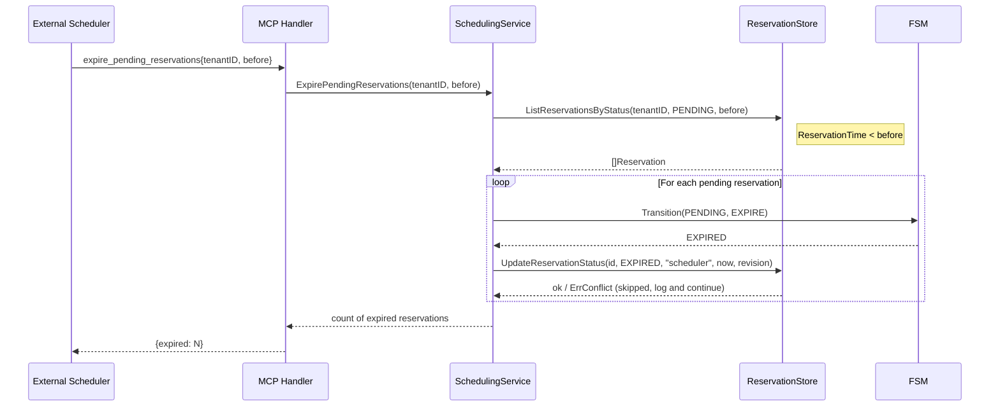

# Sequence Diagrams — appointment-booking

---

## 1. ListAvailability

Shows how the service assembles free time slots from calendar rules, exceptions, and existing reservations.

---

## 2. CreateReservation (with optional reschedule)

Shows cross-module validation, availability check, and the atomic DB transaction.
The reschedule path marks the original reservation as `RESCHEDULED` (not `CANCELLED`).

---

## 3. ChangeReservationStatus

Shows FSM enforcement and optimistic concurrency. MCP is the only external entry point.
On `ErrConflict` the MCP handler reloads the reservation and retries with the updated revision.

> **Note on reschedule:** `CreateReservation` does NOT route through this method internally.
> Within the DB transaction it calls `FSM.Transition()` + `RES.UpdateReservationStatus()` directly
> to remain within the same transaction context (see diagram 2).

---

## 4. ExpirePendingReservations

Triggered exclusively by an external scheduler via the `expire_pending_reservations` MCP tool.

