# Service Layer Tests — Domain Use Cases

Un diagrama de flujo por caso de uso: setup → acción → aserción.

---

## UC-01: CreateReservation_InactiveConfig

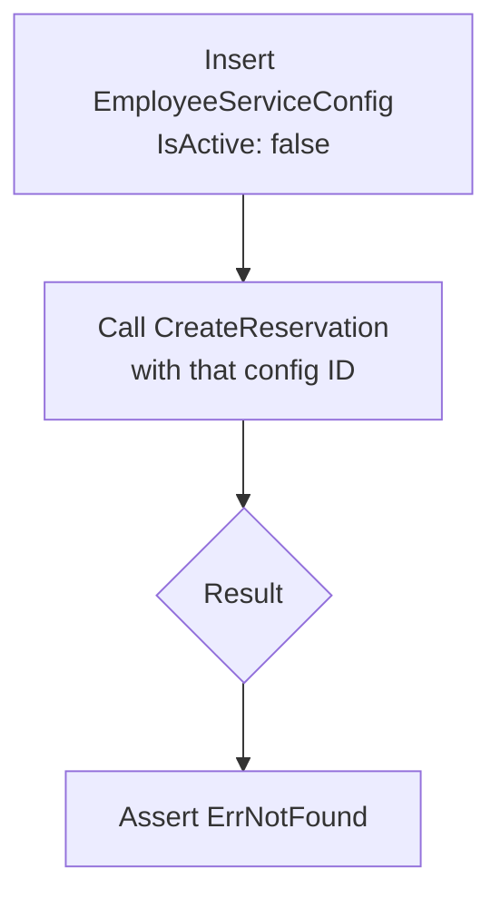
```mermaid
flowchart TD
    A[Insert EmployeeServiceConfig<br/>IsActive: false] --> B[Call CreateReservation<br/>with that config ID]
    B --> C{Result}
    C --> D[Assert ErrNotFound]
```

---

## UC-02: CreateReservation_StaffNotFound

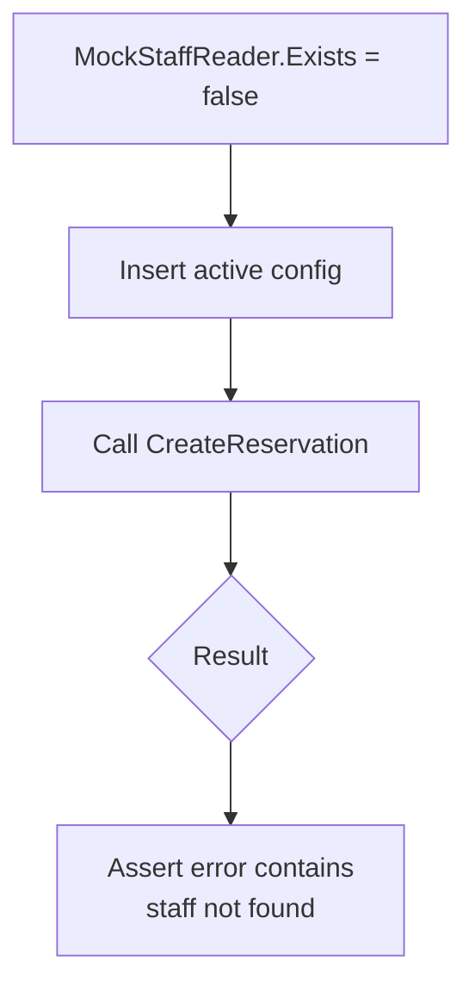
```mermaid
flowchart TD
    A[MockStaffReader.Exists = false] --> B[Insert active config]
    B --> C[Call CreateReservation]
    C --> D{Result}
    D --> E[Assert error contains<br/>staff not found]
```

---

## UC-03: CreateReservation_ServiceNotFound

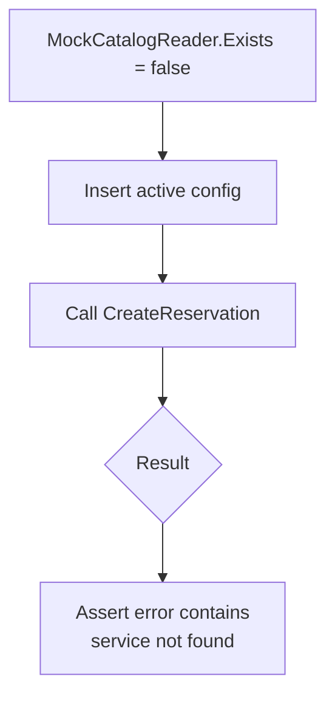
```mermaid
flowchart TD
    A[MockCatalogReader.Exists = false] --> B[Insert active config]
    B --> C[Call CreateReservation]
    C --> D{Result}
    D --> E[Assert error contains<br/>service not found]
```

---

## UC-04: CreateReservation_ClientNotFound

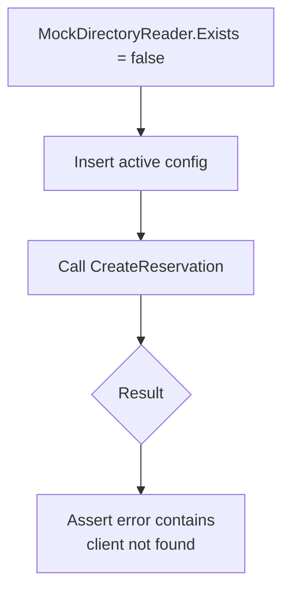
```mermaid
flowchart TD
    A[MockDirectoryReader.Exists = false] --> B[Insert active config]
    B --> C[Call CreateReservation]
    C --> D{Result}
    D --> E[Assert error contains<br/>client not found]
```

---

## UC-05: ChangeReservationStatus_Cancel_FromPending

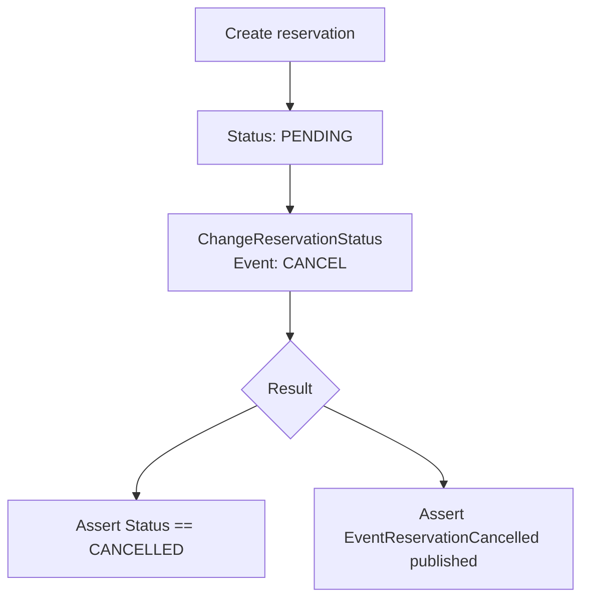
```mermaid
flowchart TD
    A[Create reservation] --> B[Status: PENDING]
    B --> C[ChangeReservationStatus<br/>Event: CANCEL]
    C --> D{Result}
    D --> E[Assert Status == CANCELLED]
    D --> F[Assert EventReservationCancelled published]
```

---

## UC-06: ChangeReservationStatus_Complete_FromConfirmed

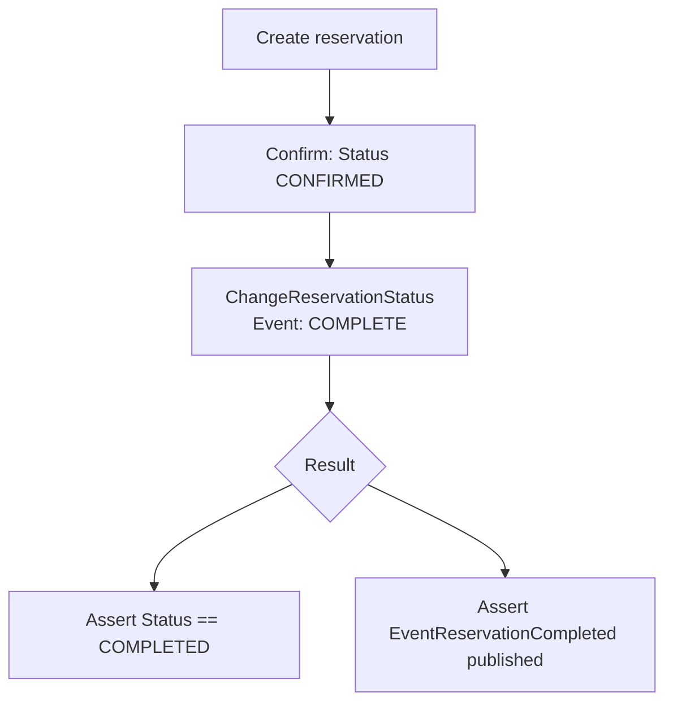
```mermaid
flowchart TD
    A[Create reservation] --> B[Confirm: Status CONFIRMED]
    B --> C[ChangeReservationStatus<br/>Event: COMPLETE]
    C --> D{Result}
    D --> E[Assert Status == COMPLETED]
    D --> F[Assert EventReservationCompleted published]
```

---

## UC-07: CreateReservation_Reschedule

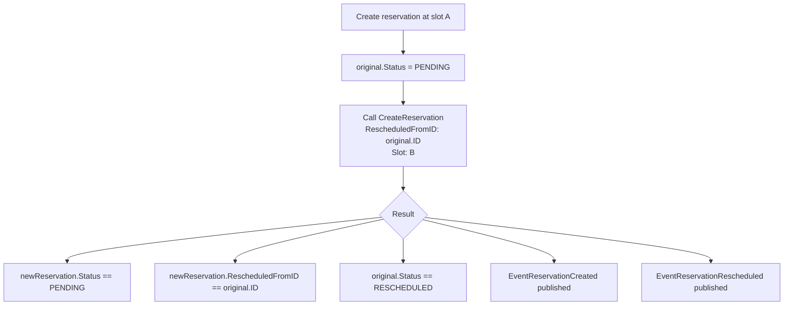
```mermaid
flowchart TD
    A[Create reservation at slot A] --> B[original.Status = PENDING]
    B --> C[Call CreateReservation<br/>RescheduledFromID: original.ID<br/>Slot: B]
    C --> D{Result}
    D --> E[newReservation.Status == PENDING]
    D --> F[newReservation.RescheduledFromID == original.ID]
    D --> G[original.Status == RESCHEDULED]
    D --> H[EventReservationCreated published]
    D --> I[EventReservationRescheduled published]
```

---

## UC-08: ListAvailability_HolidayException

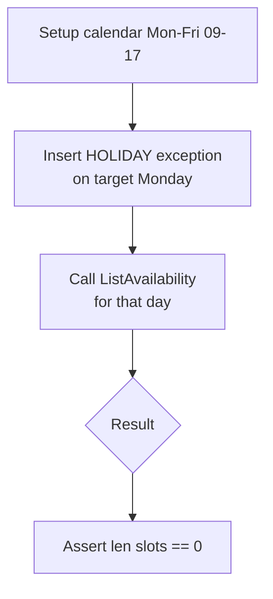
```mermaid
flowchart TD
    A[Setup calendar Mon-Fri 09-17] --> B[Insert HOLIDAY exception<br/>on target Monday]
    B --> C[Call ListAvailability<br/>for that day]
    C --> D{Result}
    D --> E[Assert len slots == 0]
```

---

## UC-09: ListAvailability_BlockedException

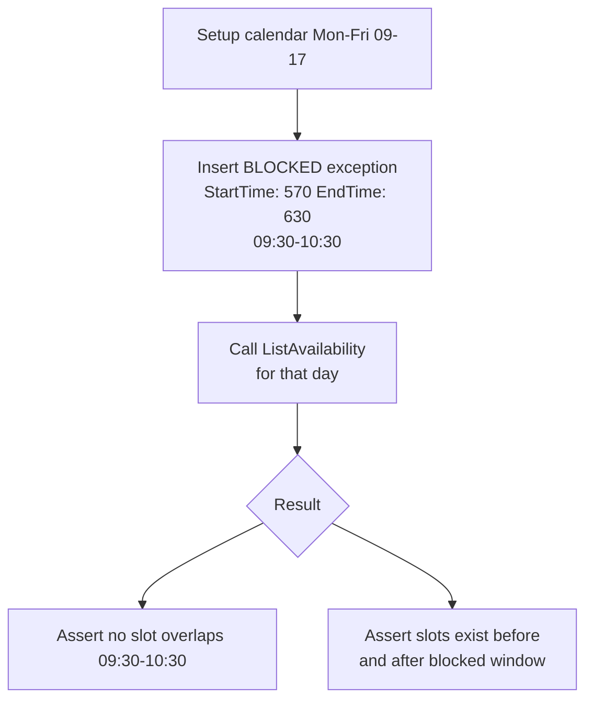
```mermaid
flowchart TD
    A[Setup calendar Mon-Fri 09-17] --> B[Insert BLOCKED exception<br/>StartTime: 570 EndTime: 630<br/>09:30-10:30]
    B --> C[Call ListAvailability<br/>for that day]
    C --> D{Result}
    D --> E[Assert no slot overlaps 09:30-10:30]
    D --> F[Assert slots exist before<br/>and after blocked window]
```

---

## UC-10: ListAvailability_SpecialHoursException

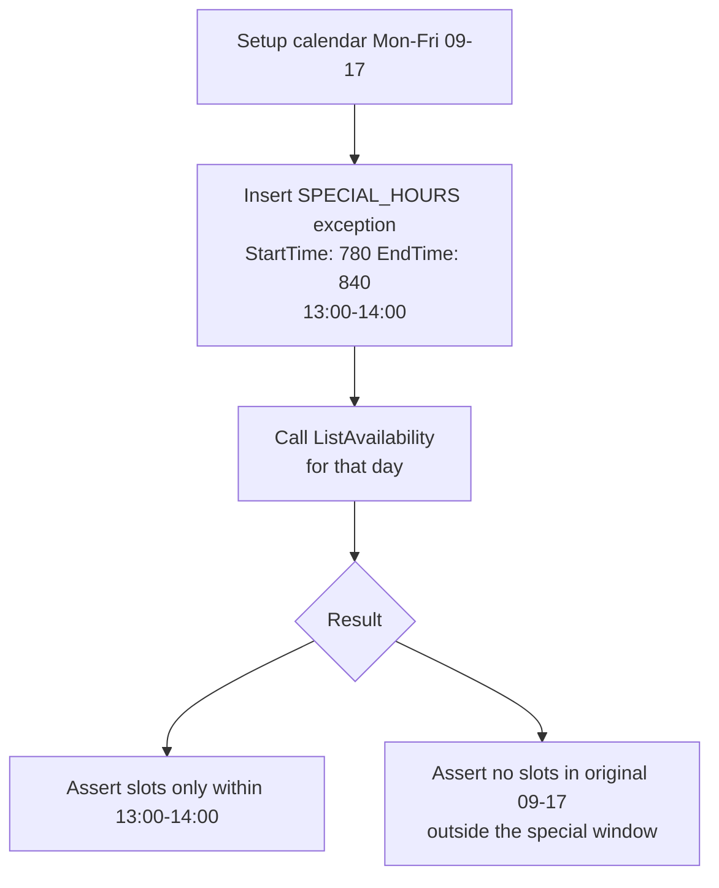
```mermaid
flowchart TD
    A[Setup calendar Mon-Fri 09-17] --> B[Insert SPECIAL_HOURS exception<br/>StartTime: 780 EndTime: 840<br/>13:00-14:00]
    B --> C[Call ListAvailability<br/>for that day]
    C --> D{Result}
    D --> E[Assert slots only within 13:00-14:00]
    D --> F[Assert no slots in original 09-17<br/>outside the special window]
```

---

## UC-11: ListAvailability_BreakTime

```mermaid
flowchart TD
    A[Setup calendar<br/>WorkStart: 540 WorkFinish: 720<br/>BreakStart: 630 BreakFinish: 660<br/>Duration: 30 min] --> B[Call ListAvailability]
    B --> C{Result}
    C --> D[Assert slot 09:00 exists]
    C --> E[Assert slot 09:30 exists]
    C --> F[Assert NO slot overlaps 10:30-11:00]
    C --> G[Assert slot 11:00 exists]
    C --> H[Assert slot 11:30 exists]

---

## UC-12: UpsertWeeklyCalendar_CalendarConfigNotFound

```mermaid
flowchart TD
    A[No CalendarConfig for Staff] --> B[Call UpsertWeeklyCalendar]
    B --> C{Result}
    C --> D[Assert ErrCalendarConfigNotFound]
```

---

## UC-13: GetReservation_CrossTenantIsolation

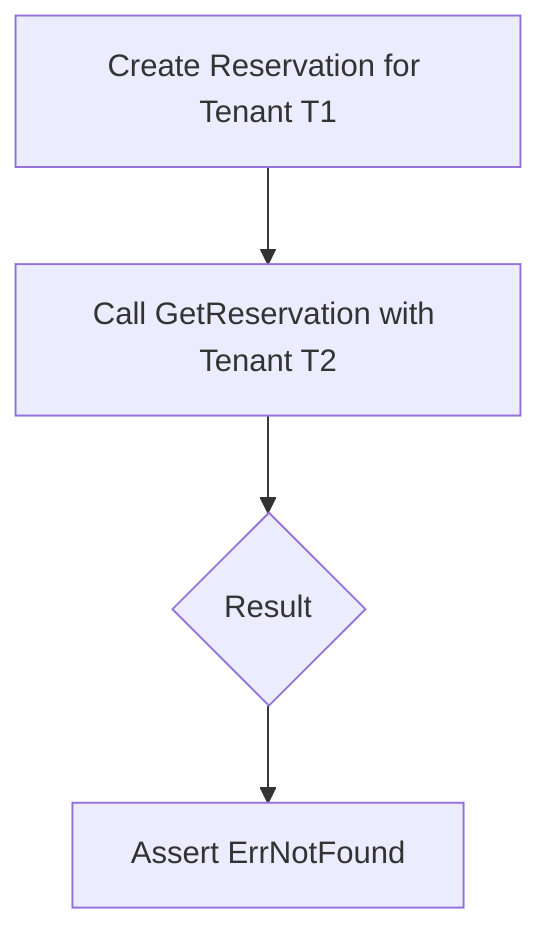
```mermaid
flowchart TD
    A[Create Reservation for Tenant T1] --> B[Call GetReservation with Tenant T2]
    B --> C{Result}
    C --> D[Assert ErrNotFound]
```

---

## UC-14: ChangeReservationStatus_CrossTenantIsolation

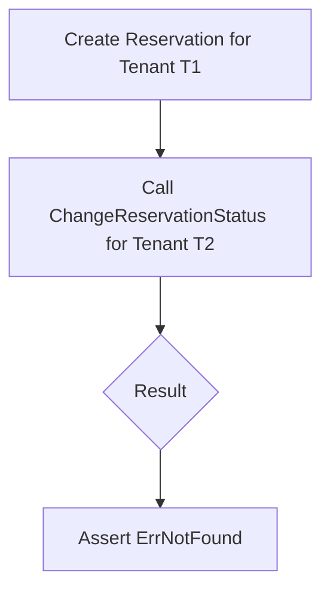
```mermaid
flowchart TD
    A[Create Reservation for Tenant T1] --> B[Call ChangeReservationStatus for Tenant T2]
    B --> C{Result}
    C --> D[Assert ErrNotFound]
```

---

## UC-15: ListAvailability_NoCalendarConfig

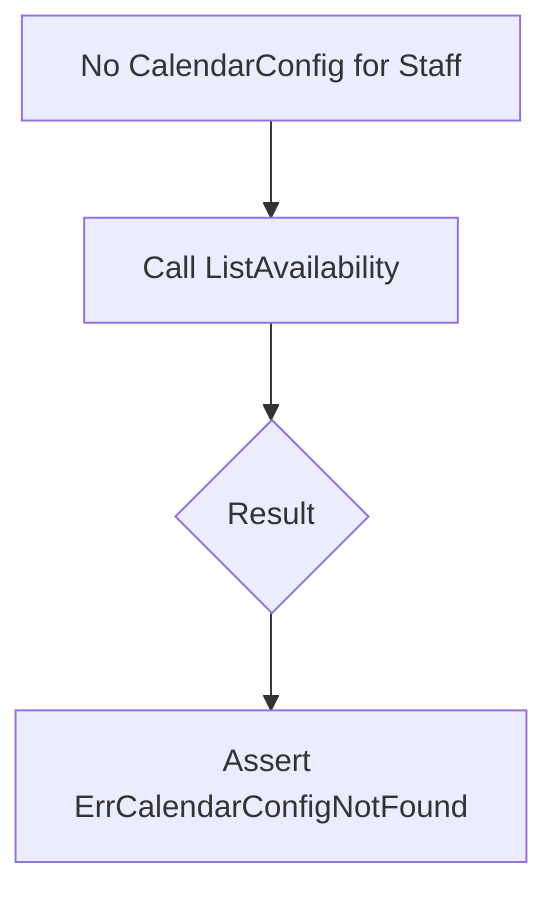
```mermaid
flowchart TD
    A[No CalendarConfig for Staff] --> B[Call ListAvailability]
    B --> C{Result}
    C --> D[Assert ErrCalendarConfigNotFound]
```

---

## UC-16: ListAvailability_InactiveCalendarConfig

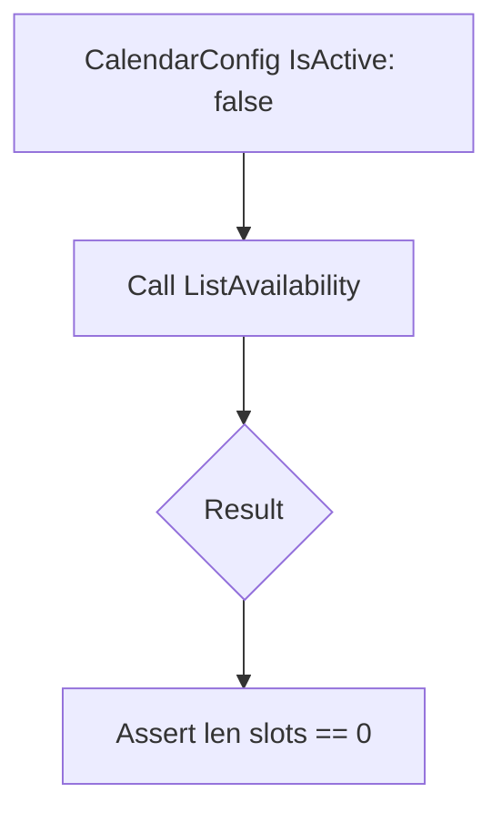
```mermaid
flowchart TD
    A[CalendarConfig IsActive: false] --> B[Call ListAvailability]
    B --> C{Result}
    C --> D[Assert len slots == 0]
```

---

## UC-17: CreateReservation_SlotOutsideWorkHours

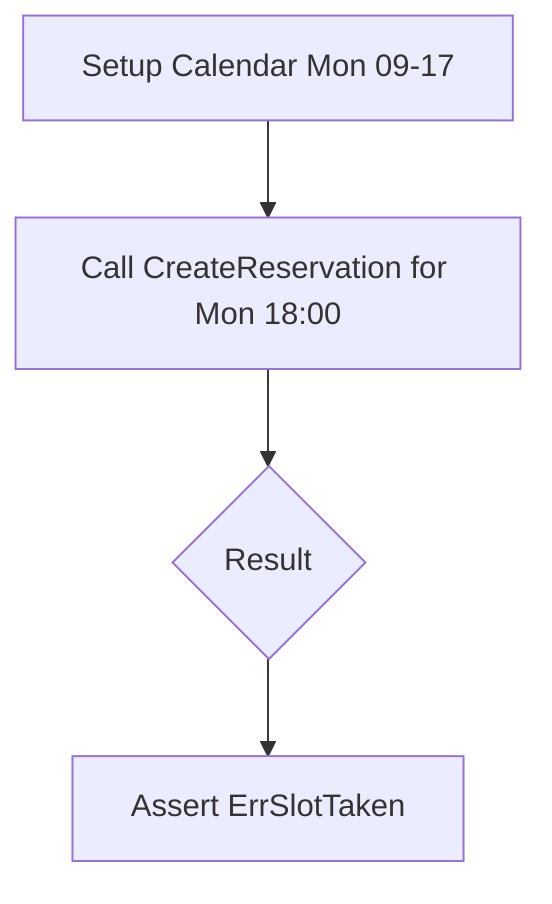
```mermaid
flowchart TD
    A[Setup Calendar Mon 09-17] --> B[Call CreateReservation for Mon 18:00]
    B --> C{Result}
    C --> D[Assert ErrSlotTaken]
```

---

## UC-18: ChangeReservationStatus_ConfirmWithPaymentID

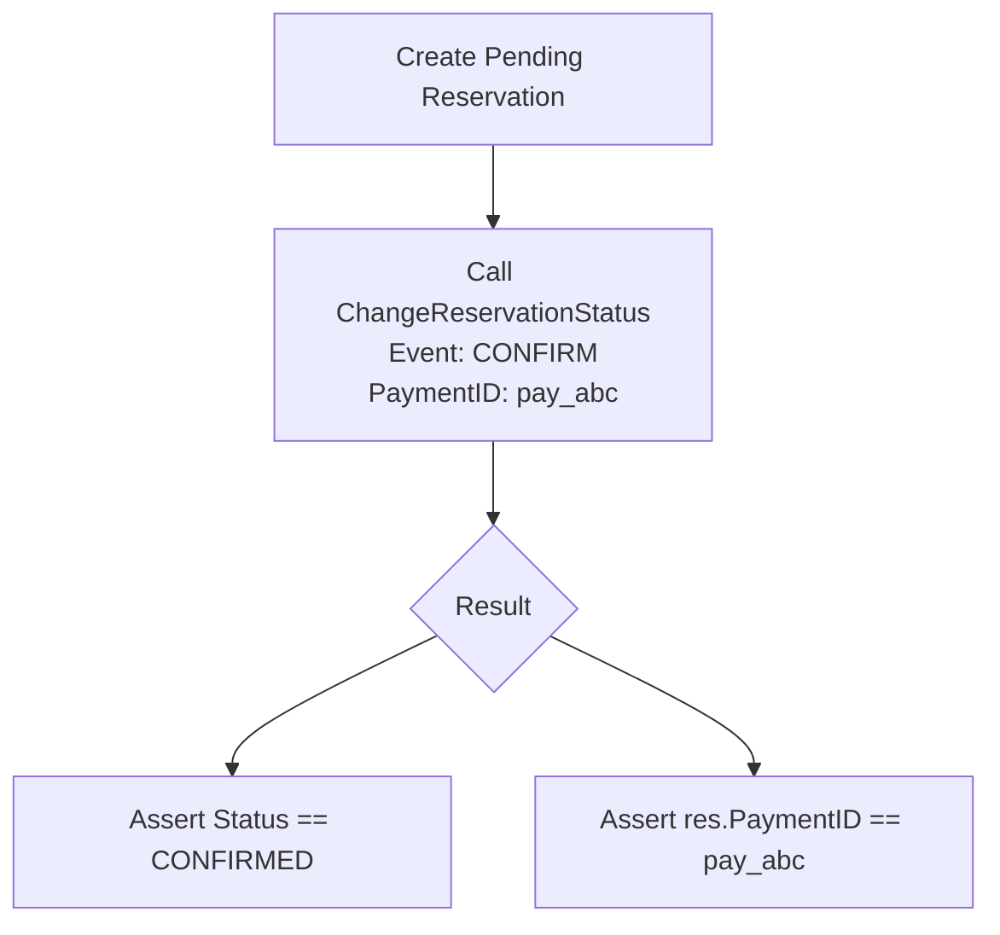
```mermaid
flowchart TD
    A[Create Pending Reservation] --> B[Call ChangeReservationStatus<br/>Event: CONFIRM<br/>PaymentID: pay_abc]
    B --> C{Result}
    C --> D[Assert Status == CONFIRMED]
    C --> E[Assert res.PaymentID == pay_abc]
```

---

## UC-19: ListReservationsByStaff_ViaService

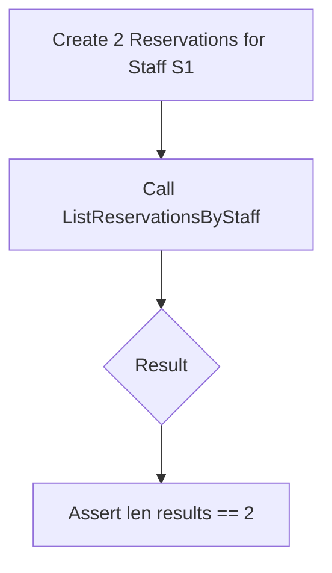
```mermaid
flowchart TD
    A[Create 2 Reservations for Staff S1] --> B[Call ListReservationsByStaff]
    B --> C{Result}
    C --> D[Assert len results == 2]
```

---

## UC-20: ExpirePendingReservations_NothingToExpire

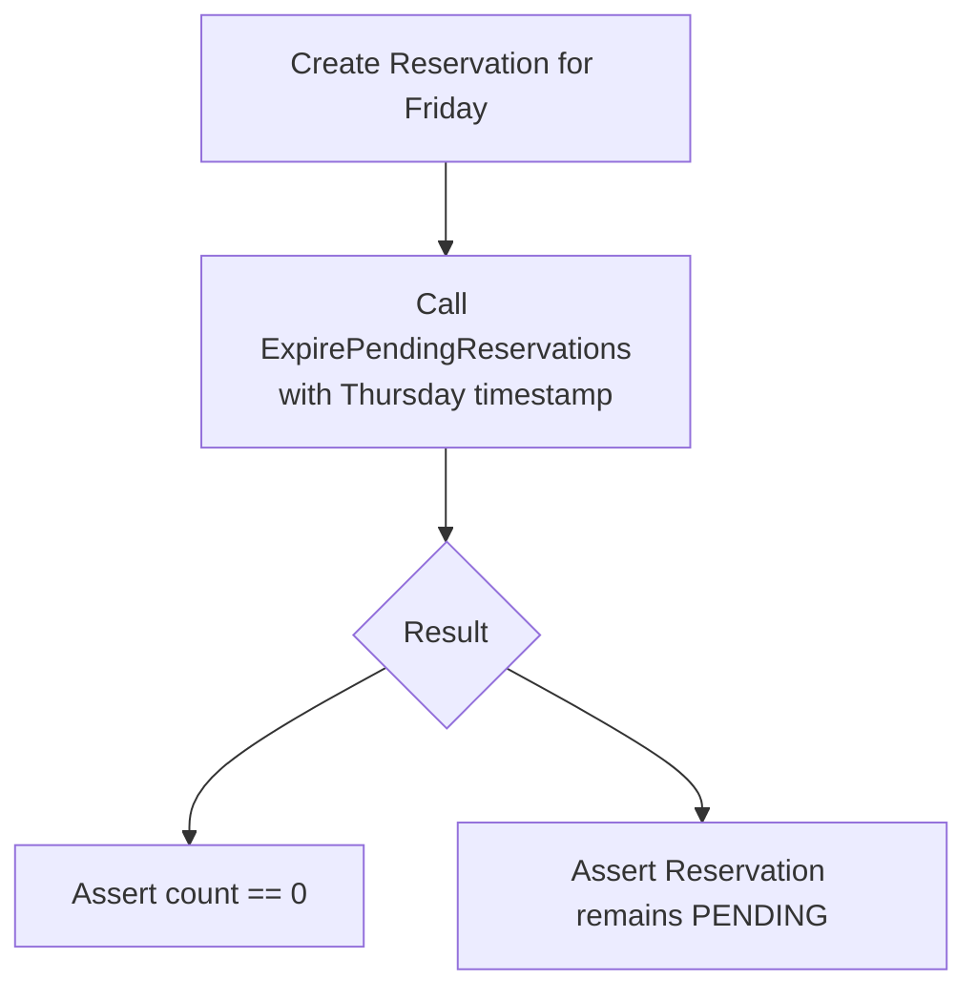
```mermaid
flowchart TD
    A[Create Reservation for Friday] --> B[Call ExpirePendingReservations<br/>with Thursday timestamp]
    B --> C{Result}
    C --> D[Assert count == 0]
    C --> E[Assert Reservation remains PENDING]
```
```
